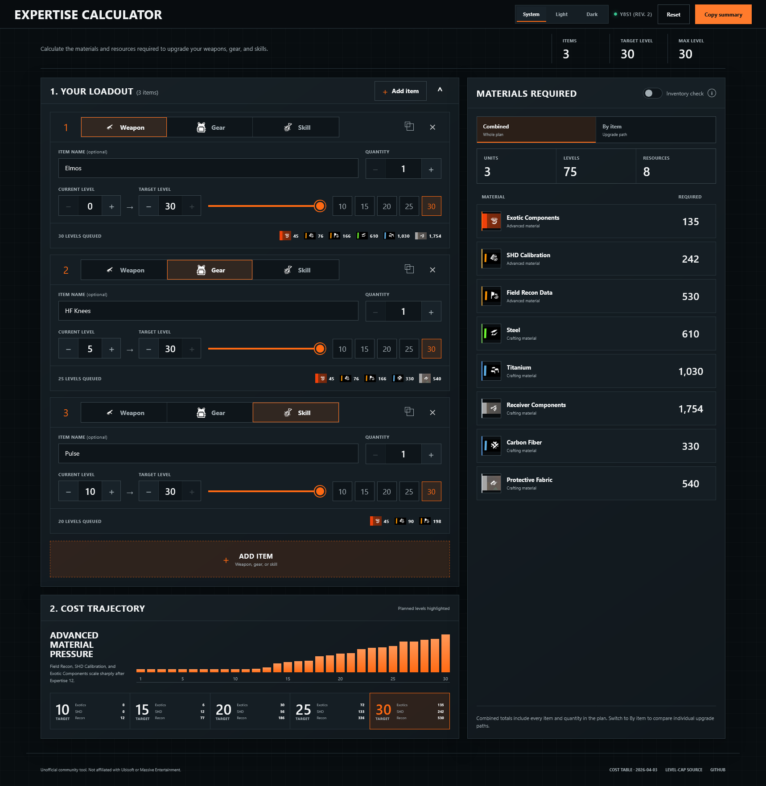

# Expertise Calculator

Plan the materials required to upgrade weapons, gear, and skills in *Tom Clancy's The Division 2* Expertise system.

[Open the calculator](https://skuldgerry.github.io/division2-expertise-calculator/) · [Changelog](CHANGELOG.md)



## Features

- Plan Expertise upgrades from level 0 through 30 with the current Y8S1 costs.
- Combine up to 12 named weapon, gear, or skill entries with individual quantities.
- Compare the complete plan with per-item material requirements to choose an upgrade path.
- Enter wallet amounts to see which materials are covered and which are still short.
- Review level 10, 15, 20, 25, and 30 checkpoints alongside the advanced-material cost trajectory.
- Use System, Light, or Dark themes; plan, inventory, and explicit theme choices stay on the device.
- Copy a plain-text summary for sharing or later reference.

All level and quantity controls support direct typing plus labelled increment and decrement buttons. The interface includes visible keyboard focus, semantic control states, and reduced-motion support.

## Cost data

The calculator uses the community-maintained [Y8S1 Expertise Upgrade Cost Table, revision 2](https://www.reddit.com/r/thedivision/comments/1sasd3y/expertise_upgrades_table_updated_to_y8s1/), published 3 April 2026. The maximum Expertise level of 30 is documented by Ubisoft in [The Division 2: The Pact](https://www.ubisoft.com/en-au/game/the-division/news-updates/3DFEM2OnnbfRsDrQWXsbbO/the-division-2-the-pact).

Skills intentionally use a separate schedule: post-update in-game testing found that their normal crafting-material costs did not receive the same reduction as weapons and gear. Exotic Component costs were reduced for all categories.

## Development

Requires Node.js 22.13 or newer.

```bash
git clone https://github.com/skuldgerry/division2-expertise-calculator.git
cd division2-expertise-calculator
npm ci
npm run dev
```

Open the local address printed by the development server.

## Checks

```bash
npm test
npm run lint
```

The test suite builds the deployable output, verifies the server-rendered interface, and checks known 0-to-30 totals and calculation boundaries.

## Deployment

Pushes to `main` build and publish the static export through GitHub Actions to [GitHub Pages](https://skuldgerry.github.io/division2-expertise-calculator/).

## License

[MIT](LICENSE). The Division, Ubisoft, and Massive Entertainment names and imagery belong to their respective owners. This is an unofficial community tool and is not affiliated with Ubisoft or Massive Entertainment.
